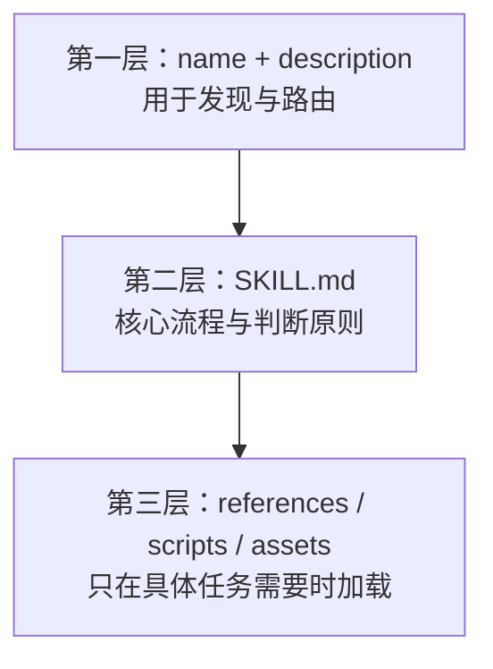
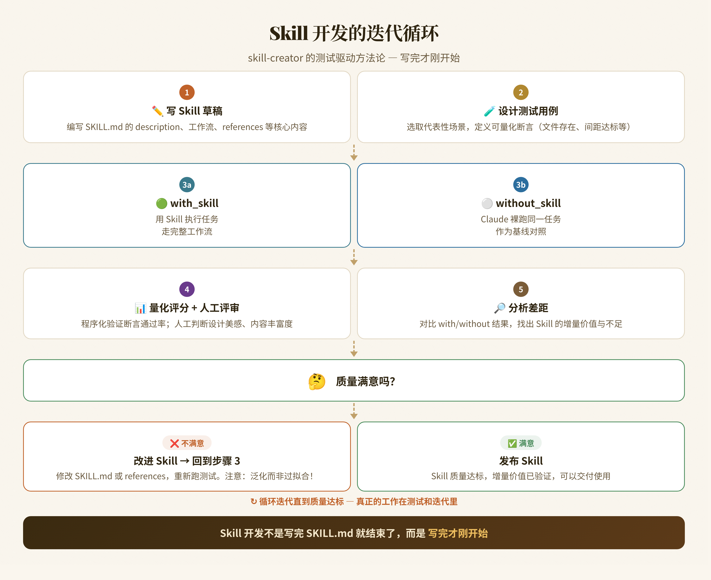

Agent Skill 可以理解为一份给智能体使用的领域工作手册：它不仅告诉模型“做什么”，还提供判断原则、操作步骤、参考资料和可重复执行的脚本。

一个 Skill 是否好用，通常不取决于篇幅，而取决于三个问题：模型能否在正确的场景发现它、加载后能否迅速找到需要的信息、遇到新情况时能否做出合理判断。

结合 `skill-creator` 的组织方式，我把其中最值得复用的思路整理成七条设计原则。

## 用三层结构实现渐进式加载

Skill 不应该把所有背景知识一次性塞进上下文。更合适的结构是按需逐层加载：



第一层要足够短，让系统能在大量 Skill 中快速判断相关性；第二层包含完成任务所需的主流程；第三层承载较长的文档、模板、示例和确定性工具。

这种分层解决了两个相反的问题：信息太少时模型无法完成工作，信息太多时关键指令又容易被淹没。

一个实用的目录可以是：

```text
my-skill/
├── SKILL.md
├── references/
│   ├── api.md
│   └── style-guide.md
├── scripts/
│   └── validate.py
└── assets/
    └── template.md
```

`SKILL.md` 负责导航，不必复制所有细节。需要 API 时读 `references/api.md`，需要校验时运行 `scripts/validate.py`，需要产物骨架时复用 `assets/template.md`。

## 把 description 当作路由规则

很多 Skill 写得很完整，却经常不触发，问题通常出在 description。

description 不是给人看的宣传语，而是智能体判断“此刻是否应该加载这个 Skill”的路由规则。它至少要回答：

- 这个 Skill 能完成什么任务；
- 用户会在什么场景下需要它；
- 哪些相近场景不属于它。

不够有效的写法：

```yaml
description: Helps with documents.
```

更清楚的写法：

```yaml
description: >-
  Create, edit, redline, and review Word documents.
  Use when the user asks to produce or modify a .docx file,
  preserve document styles, or inspect tracked changes.
  Do not use for PDFs or spreadsheets.
```

前者只提供一个模糊主题，后者给出了能力、触发场景和边界。模型不需要猜“documents”究竟指什么。

与其堆积关键词，不如描述用户真实会提出的请求。关键词覆盖不到表达方式的变化，场景描述更容易表达意图。

## 解释 Why，给模型留下判断空间

Skill 需要约束，但不能只有 `MUST` 和 `NEVER`。当规则背后没有原因时，模型只能机械匹配；一旦遇到作者没写过的场景，它就不知道应该坚持还是变通。

例如：

```markdown
优先复用现有模板，因为模板已经包含品牌字体、页边距和层级规范。
只有当模板无法表达用户明确要求的版式时，才创建新结构。
```

这段话同时给出了默认动作、原因和例外条件。模型面对新任务时，仍然可以沿着目标做判断。

原则不等于宽泛口号。好的原则应包含：

- 想保护的目标；
- 推荐的默认行为；
- 允许偏离的条件；
- 偏离后仍需满足的底线。

## 同时测试“用了 Skill”和“没用 Skill”

只验证最终答案看起来是否不错，无法证明 Skill 真正带来了价值。更有效的测试是为同一任务保留两组结果：

- `with_skill`：加载 Skill 后执行；
- `without_skill`：不加载 Skill，作为基线。



比较时可以同时使用两类检查：

### 可程序化断言

适合验证确定性条件，例如：

- 目标文件是否生成；
- front matter 是否包含必填字段；
- 输出中是否泄露敏感路径；
- 指定命令是否退出成功；
- 产物能否通过构建或格式校验。

### 人工或模型评审

适合评估更主观的质量，例如：

- 结构是否清楚；
- 结论是否有足够证据；
- 是否出现无意义的重复；
- 风格是否符合目标读者；
- 面对异常场景时判断是否合理。

如果两组结果没有稳定差异，说明 Skill 可能只是增加了上下文，并没有真正改变决策或产物质量。

## 防止测试驱动出过拟合规则

测试发现问题后，最直接的反应是再加一条特殊规则。但如果每个失败案例都对应一条补丁，Skill 很快会变成长而脆弱的条件列表。


假设一个图表生成 Skill 在测试中遇到折线重叠。过拟合的修复可能是：

```text
当图表类型是折线图并且系列数大于 4 时，把线高改成 40px。
```

更具泛化能力的原则是：

```text
为标签和连线预留与内容密度相匹配的空间；
当画布尺寸变化时，优先使用可自适应的间距和最小尺寸。
```

前者只处理已知测试，后者解释了问题的原因，也能覆盖柱状图、流程图和新的画布尺寸。

每次准备加规则时，可以先问三个问题：

1. 失败背后的共同原因是什么？
2. 这个规则能否覆盖尚未见过的相邻场景？
3. 如果未来删除测试用例，这条规则本身是否仍有价值？

## 把重复且确定的操作交给脚本

语言模型适合理解意图、做取舍和生成内容，不适合反复手工完成严格、机械的转换。

适合写成脚本的工作包括：

- 检查目录和必填字段；
- 批量转换文件格式；
- 解析稳定的数据结构；
- 运行构建、测试和静态检查；
- 对产物执行可重复的安全扫描。

适合留给模型的工作包括：

- 判断用户真正想解决的问题；
- 在多个合理方案之间权衡；
- 根据上下文调整表达和结构；
- 解释失败原因并提出下一步。

脚本应该小而明确：写清输入、输出、依赖和失败方式。不要把一个新的复杂系统藏进 Skill；否则维护成本只是从提示词转移到了代码。

## 按领域拆分参考资料，并明确加载条件

当参考资料越来越多，简单地把它们全部放进一个大文件，会破坏渐进式加载的意义。

更好的方式是按领域拆分：

```text
references/
├── authentication.md
├── content-model.md
├── deployment.md
└── troubleshooting.md
```

然后在 `SKILL.md` 中明确路由：

```markdown
- 认证、授权或 token 问题：读取 `references/authentication.md`
- 数据结构和字段约束：读取 `references/content-model.md`
- 发布与回滚：读取 `references/deployment.md`
- 常见失败和恢复步骤：读取 `references/troubleshooting.md`
```

文件名应该表达内容，加载条件应该可以由任务直接判断。避免让模型为了找到一条信息，先遍历整个 `references` 目录。

## 一张表总结

| 原则 | 解决的问题 | 落地方式 |
| --- | --- | --- |
| 渐进式加载 | 上下文过载 | 元数据、主流程、资源分层 |
| description 路由 | Skill 漏触发或误触发 | 写能力、场景和边界 |
| 解释 Why | 规则无法适应新情况 | 给目标、默认行为和例外 |
| 对照测试 | 无法判断 Skill 是否有效 | 比较 with / without Skill |
| 防止过拟合 | 规则越来越碎 | 从失败案例提炼共同原因 |
| 脚本化确定性工作 | 重复操作不稳定 | 用小脚本完成校验与转换 |
| 按领域拆参考资料 | 找不到真正需要的信息 | 拆文件并写清加载条件 |

## 结语

一个可靠的 Skill 不是越长越好，也不是规则越多越好。它更像一套分层的决策支持系统：入口负责发现，正文负责流程和原则，参考资料负责深度，脚本负责确定性。

写 Skill 时始终围绕三个目标取舍：**容易触发、按需加载、能够泛化。** 做到这三点，Skill 才能从一次性的提示词，变成可测试、可复用、可维护的能力模块。
