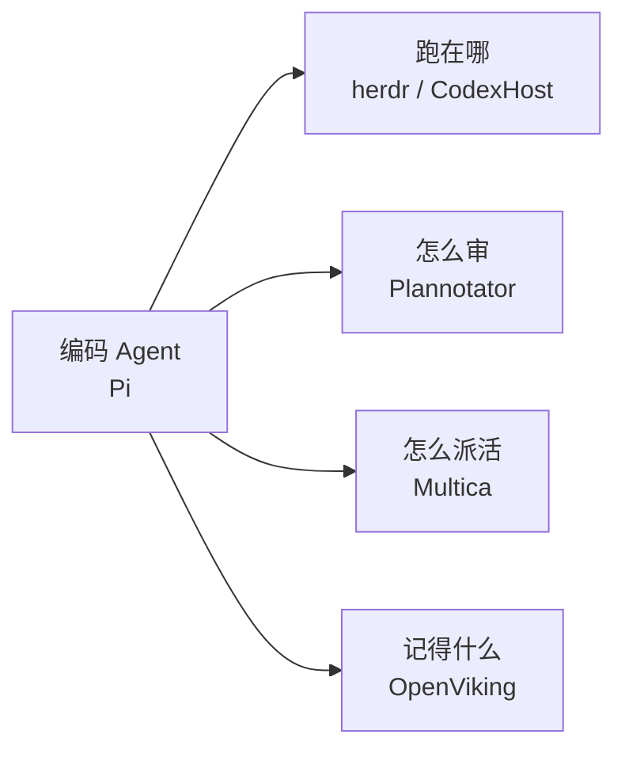

> 这是一篇**总导航**。每个仓库单独一篇详解（简介 / 亮点 / 架构 / 上手 / 适用场景），这里只放定位和入口。
>
> 详解文统一分类：[开源仓库](/categories/开源仓库/)

当前收录集中在 **AI Coding Agent 生态**：从编码 Agent 本体、终端运行时、桌面宿主，到计划评审、团队协作与上下文记忆。

## 编码 Agent

**[Pi](/p/pi/)** — [earendil-works/pi](https://github.com/earendil-works/pi)

开源 AI Agent 工具包与可自我扩展的编码 Agent。统一多模型 API、Agent 循环、终端 UI 拆成可复用包；社区生态活跃，被 Multica / Plannotator / CodexHost 原生对接。

## 终端运行时

**[herdr](/p/herdr/)** — [herdrdev/herdr](https://github.com/herdrdev/herdr)

给编码 Agent 用的终端运行时。不替换终端，接管 Agent 的 pane：detach 仍在跑、多机一窗、working/blocked/idle 一眼可见、CLI + Socket API 供 Agent 互相编排。Rust 单二进制。

## 桌面宿主

**[CodexHost](/p/codex-host/)** — [BytePioneer-AI/codex-host](https://github.com/BytePioneer-AI/codex-host)

在 Codex Desktop 里直接跑 Pi、Claude Code 等其他 Harness。用 CDP 增强官方桌面、按各 Harness 原生协议接入，保留流式/Diff/审批，而不是削平成 ACP。

## 计划与代码评审

**[Plannotator](/p/plannotator/)** — [backnotprop/plannotator](https://github.com/backnotprop/plannotator)

本地浏览器里的 Agent 评审台。标注 plan / 文档 / HTML，审 diff 与 PR，反馈一键送回 Claude Code、Codex、Pi 等。默认本地、不收集遥测。

## 人机协作工作区

**[Multica](/p/multica/)** — [multica-ai/multica](https://github.com/multica-ai/multica)

可自托管的开源工作区：给 Agent 派 Issue，它自己接活、汇报、求助，结果交回人 review。支持 26 种 Agent CLI，执行日志可回放，Review gate 保证进 main 前有人拍板。

## 上下文与记忆

**[OpenViking](/p/openviking/)** — [volcengine/OpenViking](https://github.com/volcengine/OpenViking)

面向 AI Agent 的上下文数据库。记忆 / 资源 / Skills 统一成 `viking://` 虚拟文件系统；L0/L1/L2 三层按需加载；检索轨迹可观察。火山引擎开源。

---

## 维护约定

| 角色 | 文章 | 内容 |
|------|------|------|
| 总导航 | 本文 | 一句话定位 + 链接 |
| 详解 | 分类「开源仓库」下各篇 | 完整介绍 |

- 新增仓库：先加详解文（短 slug），再在本页对应分区加一条
- 详解大改时，同步更新本页 `lastmod`

> **收录标准**：实际用过觉得好用，或设计思路值得学习的开源项目。
>
> 最后更新：2026-09-09
