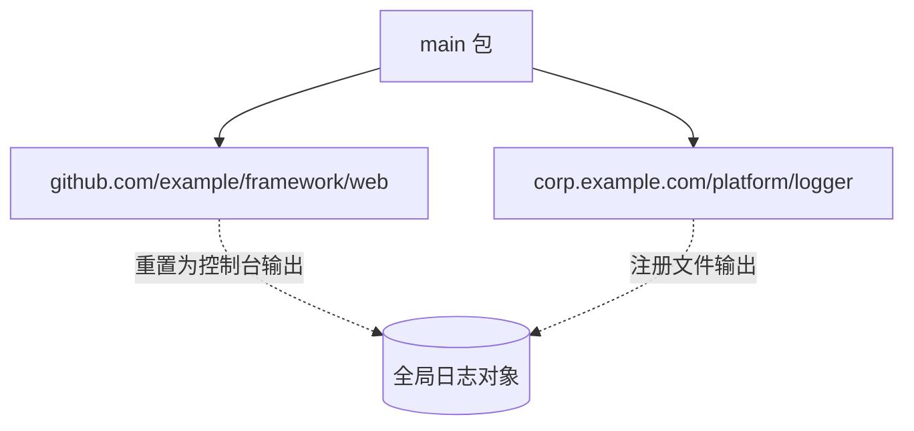

一次 Go 版本升级后，服务没有报错，控制台日志也还在，但文件日志彻底消失了。

业务代码一行没改，配置文件没有变化，日志目录权限也正常。最后发现，真正改变的不是日志组件，而是两个包的 `init` 谁先执行。

> [!IMPORTANT]
> 依赖不同包之间的隐式初始化先后关系，本质上是在依赖实现细节。它可能长期表现稳定，却不属于业务代码可以依赖的契约。

## 现象：升级以后文件日志不再生成

服务使用 Beego 的全局日志对象。内部的日志封装包在 `init` 中注册文件输出：

```go
package logger

func init() {
    logs.SetLogger(logs.AdapterFile, `{"filename":"app.log"}`)
}
```

另一个 Web 框架包也会在自己的 `init` 中重置同一个全局日志对象：

```go
package web

func init() {
    logs.Reset()
    logs.SetLogger(logs.AdapterConsole)
}
```

两个包都能独立正常工作，但它们修改的是同一份全局状态。最终配置取决于谁最后执行：



旧版本里，日志包碰巧后执行，文件输出得以保留；升级以后，框架包后执行，把文件输出覆盖了。

## 为什么改 Go 版本会影响 `init` 顺序

先区分两类顺序：

1. 有依赖关系的包，依赖包一定先完成初始化。
2. 互不依赖、同时可初始化的包，需要工具链决定先后顺序。

问题出在第二类。日志封装包和 Web 框架包之间没有依赖边，编译器和链接器只能在它们都“就绪”时选择一个。

在这次故障使用的旧工具链中，我们观察到 `main.go` 里的 import 书写顺序会影响最后结果。但这并不是 Go 语言规范承诺的行为，只是当时实现产生的可观察结果。

Go 1.21 对初始化顺序的定义更精确：当多个包同时满足初始化条件时，按导入路径的词法顺序选择。升级到新工具链后，原来碰巧成立的顺序随之改变。

例如下面两个路径：

```text
corp.example.com/platform/logger
github.com/example/framework/web
```

按词法顺序，`corp...` 先于 `github...`。于是日志包先注册文件输出，框架包随后重置日志，最终只剩控制台输出。

> [!NOTE]
> 这里不是 Go “随机”执行了 `init`，而是程序曾经依赖一个没有被语言契约保证的顺序。工具链升级只是把这个隐藏依赖暴露了出来。

## 从源码看：初始化顺序是如何生成的

只看语言规范，能知道新版本会按导入路径排序，但还解释不了这个顺序最终怎样进入可执行文件。继续沿着 Go 1.20 和 Go 1.24 的源码追下去，可以看到初始化调度从编译器、链接器到运行时的完整变化：


**第一步：编译器为每个包生成 `inittask`**

源码中的 `init` 函数并不是直接按照源文件顺序拼到 `main` 前面。编译每个包时，编译器会生成一个名为 `包路径..inittask` 的符号，用来描述这个包需要执行的初始化函数。

这里的“初始化函数”包括两类：

- 编译器为包级变量初始化生成的隐式函数；
- 开发者在源码里声明的 `func init()`。

在 Go 1.20 的 [`cmd/compile/internal/pkginit/init.go`](https://github.com/golang/go/blob/go1.20/src/cmd/compile/internal/pkginit/init.go) 中，`Task()` 生成的记录可以简化成下面的内存布局：

```text
┌───────┬───────┬──────┬──────────┬─────────┐
│ state │ ndeps │ nfns │ deps ... │ fns ... │
└───────┴───────┴──────┴──────────┴─────────┘
```

`deps` 直接保存当前包依赖的其他 `inittask` 指针，`fns` 保存本包要执行的函数。也就是说，Go 1.20 的一条 task 同时携带“依赖关系”和“执行内容”。

到了 Go 1.24，[`MakeTask()`](https://github.com/golang/go/blob/go1.24.0/src/cmd/compile/internal/pkginit/init.go) 不再把依赖指针塞进 task 的数据区，而是为每条依赖生成一个 `R_INITORDER` relocation：

```text
logger..inittask --R_INITORDER--> dependency..inittask
```

relocation 通常用于告诉链接器“某个位置引用了另一个符号”。这里 Go 借它额外表达了一条有方向的初始化依赖边：如果包 `p` 导入包 `q`，就建立 `p → q`，表示 `q` 必须先完成。

**第二步：Go 1.20 在运行时递归依赖**

Go 1.20 的 [`runtime.doInit`](https://github.com/golang/go/blob/go1.20/src/runtime/proc.go#L6471) 接收一棵 task 依赖树。它的核心逻辑可以概括为：

```go
func doInit(task *initTask) {
    for _, dependency := range task.dependencies {
        doInit(dependency)
    }
    for _, initFn := range task.functions {
        initFn()
    }
}
```

这是一种深度优先遍历：先按照 task 中记录的顺序递归所有依赖，再执行当前包自己的初始化函数。

问题在于，两个包如果互不依赖，依赖图只能约束它们都在 `main` 之前，却不能表达它们彼此之间谁先谁后。旧实现最终会继承编译器写入 `deps` 的排列。在这次故障对应的旧工具链里，这个排列又受到源码 import 处理顺序影响，于是看起来像“调整 import 就能调整 init”。

但这只是实现产生的结果，不是当时语言规范提供的保证。换编译器版本、调整文件组织或者改变依赖图，都可能让顺序发生变化。

**第三步：Go 1.21+ 把排序移动到链接阶段**

新实现把问题从“运行时递归一棵树”改成了“链接时为整个程序生成唯一调度表”。Go 1.24 的 [`inittaskSym`](https://github.com/golang/go/blob/go1.24.0/src/cmd/link/internal/ld/inittask.go#L82) 大致执行以下步骤：

1. 从 `main..inittask` 出发，沿 `R_INITORDER` relocation 找到所有可达的包；
2. 建立依赖边，并统计每个包还有多少直接依赖没有完成；
3. 把依赖计数为零的包放进 `lexHeap`；
4. 每次取出词法顺序最小的就绪包，追加到调度表；
5. 解除它对上层包的阻塞，新就绪的包继续进入堆；
6. 最终生成 `go:main.inittasks` 符号。

如果用伪代码表示，它就是带稳定 tie-break 的 Kahn 拓扑排序：

```text
ready = 所有未完成依赖数为 0 的包组成的最小堆

while ready 不为空:
    current = 弹出导入路径最小的包
    schedule 追加 current

    for 每个直接导入 current 的包:
        未完成依赖数减 1
        if 未完成依赖数变为 0:
            将它加入 ready
```

拓扑排序负责保证“被导入的包先初始化”，最小堆负责解决“多个包同时就绪时选谁”。这两部分组合后，顺序才同时满足依赖约束和 Go 1.21 新增的确定性规则。

**第四步：`lexHeap` 为什么能改变本次结果**

[`lexHeap`](https://github.com/golang/go/blob/go1.24.0/src/cmd/link/internal/ld/heap.go#L59) 是一个最小堆。普通链接器 heap 按符号编号比较，而它通过 `Loader.SymName` 比较符号名，把名字最小的 task 放在堆顶。

回到这次故障。当日志包和 Web 框架包的依赖都已经完成后，它们会同时进入 `lexHeap`：

```text
ready:
  corp.example.com/platform/logger..inittask
  github.com/example/framework/web..inittask
```

因为 `corp...` 的词法顺序在 `github...` 之前，日志包先出堆，Web 框架包后出堆。后者的 `init` 最终覆盖前者设置的文件日志，故障就此发生。

注意，`lexHeap` 不是简单地把所有包一次性按名称排序。如果包 A 依赖包 Z，即使 A 的名称更小，A 在 Z 完成前也不会进入 ready heap。准确说法应该是：**在所有依赖已经满足的包中，选择导入路径词法顺序最小的一个。**

**第五步：运行时只消费链接器生成的扁平列表**

Go 1.24 的 [`initTask`](https://github.com/golang/go/blob/go1.24.0/src/runtime/proc.go#L7296) 已经没有 `ndeps` 和依赖指针，只保留状态、函数数量及函数入口。运行时拿到的是链接器排好的 task 切片：

```go
func doInit(tasks []*initTask) {
    for _, task := range tasks {
        doInit1(task)
    }
}
```

因此在新实现中：

- 编译器负责生成每个包的初始化函数和依赖 relocation；
- 链接器负责对整个包依赖图排序；
- 运行时负责按照结果逐个执行，不再递归决定包顺序。

这也是为什么只升级工具链、不修改业务代码，最终执行顺序仍然可能变化：**顺序本身就是编译和链接产物的一部分。**

**如何在自己的程序里验证**

可以用 `inittrace` 查看二进制实际执行的包初始化顺序：

```bash
GODEBUG=inittrace=1 ./your-program 2>&1 | less
```

输出会包含包路径、开始时间、耗时、分配字节数和分配次数。为了减少第三方包的干扰，也可以在最小复现项目的两个 `init` 里分别打印标记，再使用不同 Go 工具链编译对比。

`inittrace` 展示的是最终执行结果；对照编译器生成的 `R_INITORDER` 和链接器的 `inittaskSym`，才能解释这个结果是如何形成的。

## 排查过程

**先排除常见运行时问题**

最先检查的仍然应该是配置、路径和权限：

- 日志配置是否被正确加载；
- 相对路径是否因为工作目录变化而指向别处；
- 运行用户是否有目录写权限；
- 磁盘空间和 inode 是否充足；
- 日志组件有没有返回但未处理的错误。

这些检查都没有异常，而且控制台日志正常，说明日志调用本身仍然执行，只是输出目标变了。

**搜索所有全局日志配置入口**

继续搜索 `SetLogger`、`Reset` 等调用，发现两个包都在 `init` 中修改 Beego 的全局日志状态。

这时问题从“为什么文件写不出来”变成了“最后是谁改了配置”。

**用显式调用验证猜想**

在 `main` 启动流程中，等所有包初始化完成后再次设置日志：

```go
func main() {
    logger.Init()
    run()
}
```

文件日志立即恢复，说明路径和权限都没问题，根因就是初始化阶段的配置覆盖。

**对比工具链行为**

最后对比旧、新 Go 版本的包初始化规则和链接器实现，确认升级改变了两个无依赖包的选择顺序，完整解释了故障为什么只在升级后出现。

## 修复：把隐式副作用变成显式初始化

最终修复不是调整 import 的排列，也不是给包名制造字典序优势，而是移除对顺序的依赖。

日志包提供显式的 `Init`：

```go
package logger

import "github.com/beego/beego/v2/core/logs"

func Init() error {
    logs.Reset()
    return logs.SetLogger(
        logs.AdapterFile,
        `{"filename":"app.log"}`,
    )
}
```

入口函数在框架初始化完成后调用它，并处理错误：

```go
func main() {
    if err := logger.Init(); err != nil {
        panic(err)
    }

    run()
}
```

这样，日志配置的时机由启动流程明确控制，而不是由两个包路径的排序间接决定。

如果项目有依赖注入或应用生命周期管理，也可以把日志器作为依赖传入。关键点只有一个：**重要的运行时配置应该有明确的所有者和执行时机。**

## 为什么不推荐其他“修复”

### 调整 import 顺序

它可能在某个旧工具链上有效，但没有解决隐式依赖，新版本也不一定继续遵循相同结果。

### 用空白导入强行制造依赖

```go
import _ "github.com/example/framework/web"
```

这能影响依赖图，却很难表达“我要在框架之后配置日志”的真实意图，也会让维护者困惑。

### 重命名包或修改导入路径

这是把业务正确性绑定到字典序。即使暂时生效，也会在下一次依赖调整时再次埋雷。

## 从这次问题里得到的经验

### `init` 适合注册，不适合争夺全局配置

驱动注册、静态表填充等相对独立且幂等的操作，可以放在 `init` 中。日志、数据库、缓存、指标等影响全局运行状态的配置，最好由 `main` 显式完成。

### 工具链升级也可能改变运行时行为

即使业务源码不变，编译器、链接器和标准库都属于程序行为的一部分。升级 Go 时，除了跑测试，还要关注启动流程、全局状态和依赖初始化等边界。

### 修复偶现问题时，先寻找隐藏的顺序依赖

如果问题只在某些版本、构建环境或依赖组合下出现，可以优先检查：

- 多个 `init` 是否修改同一全局变量；
- map 遍历结果是否被当作稳定顺序；
- goroutine 调度先后是否影响正确性；
- 文件系统或依赖扫描结果是否未经排序；
- 测试是否依赖执行顺序或残留状态。

这类问题表面像“升级引入了 bug”，本质往往是升级打破了一个长期存在的偶然条件。

## 参考资料

- [Go 1.21 Release Notes](https://go.dev/doc/go1.21)
- [Go 语言规范：Package initialization](https://go.dev/ref/spec#Package_initialization)
- [Go issue #57411：define initialization order more precisely](https://github.com/golang/go/issues/57411)
- [Go 1.20 编译器生成初始化任务的实现](https://github.com/golang/go/blob/go1.20/src/cmd/compile/internal/pkginit/init.go)
- [Go 1.20 运行时递归执行初始化任务的实现](https://github.com/golang/go/blob/go1.20/src/runtime/proc.go#L6451)
- [Go 1.24 编译器生成初始化任务和依赖 relocation 的实现](https://github.com/golang/go/blob/go1.24.0/src/cmd/compile/internal/pkginit/init.go)
- [Go 1.24 链接器生成初始化调度表的实现](https://github.com/golang/go/blob/go1.24.0/src/cmd/link/internal/ld/inittask.go)
- [Go 1.24 `lexHeap` 实现](https://github.com/golang/go/blob/go1.24.0/src/cmd/link/internal/ld/heap.go#L59)
- [Go 1.24 运行时执行初始化任务的实现](https://github.com/golang/go/blob/go1.24.0/src/runtime/proc.go#L7296)
