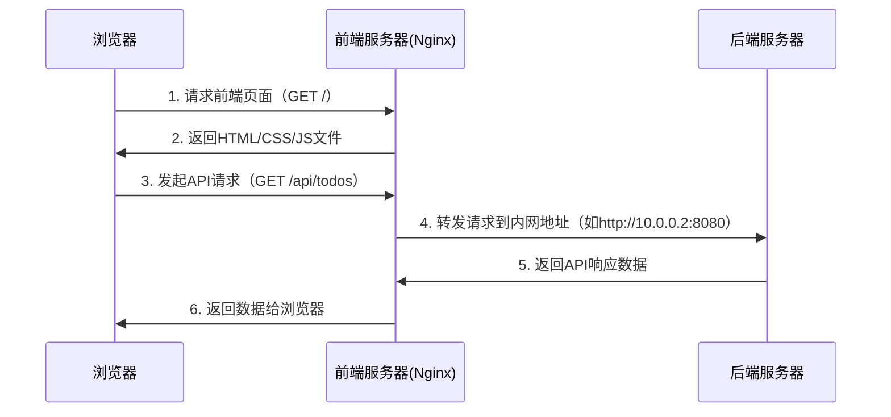

------

## **核心原则**

|       访问场景        | 推荐域名类型 |                             说明                             |
| :-------------------: | :----------: | :----------------------------------------------------------: |
|  **前端 → 后端接口**  | 内网域名/IP  | 前端与后端部署在同一内网，通过反向代理通信，减少公网暴露风险。 |
| **客户端 → 后端接口** |   外网域名   | 客户端（如移动端、第三方）需通过公网访问，需暴露外网域名并加固安全。 |

------

## **典型场景及配置方案**

### **场景1：纯Web应用（仅前端调用后端）**

- **架构特点**：

  - 前端部署在公网（如Nginx/CDN），后端在内网。
  - 所有接口仅由前端调用，**客户端不直接访问后端**。

- **配置方案**：

  1. **前端调用后端**：Nginx使用内网域名/IP代理后端服务（如 `proxy_pass http://internal-api.example.com`）。
  2. **客户端访问**：仅访问前端域名（如 `https://www.example.com`），不暴露后端接口。

  ```nginx
  # 前端Nginx配置
  location /api/ {
      proxy_pass http://internal-api.example.com:8080;  # 内网域名
      proxy_set_header Host $host;
  }
  ```

### **场景2：混合应用（前端+客户端均需调用后端）**

- **架构特点**：

  - 后端需同时服务前端（Web）和客户端（App/第三方）。
  - 需区分内部接口和开放接口。

- **配置方案**：

  1. **前端调用后端**：通过内网域名/IP（走反向代理）。
  2. **客户端调用后端**：通过外网域名（如 `https://api.example.com`），配合API网关、鉴权和限流。

  ```nginx
  # 对外API网关配置
  server {
      listen 443 ssl;
      server_name api.example.com;  # 外网域名
  
      location /public-api/ {
          proxy_pass http://backend-cluster;  # 后端集群内网地址
          # 安全加固：API密钥验证、速率限制等
      }
  }
  ```

### **场景3：全开放API服务（如第三方集成）**

- 架构特点：
  - 后端需完全暴露给公网，供多客户端直接调用。
- 配置方案：
  1. 统一使用外网域名（如 `https://api.example.com`）。
  2. 通过**API网关**管理流量，并启用HTTPS、OAuth2、IP白名单等安全措施。

------

## **安全最佳实践**

1. **内网通信加固**

   - 使用内网域名/IP，避免后端直接暴露在公网。

   - 通过防火墙限制后端端口仅允许前端服务器IP访问。

     ```bash
     # 后端服务器防火墙规则（示例）
     sudo ufw allow from 前端服务器IP to any port 8080
     sudo ufw deny 8080  # 禁止其他IP访问
     ```

2. **外网接口防护**

   - **HTTPS加密**：强制所有外网域名使用SSL/TLS。

   - **鉴权机制**：JWT、OAuth2、API Key等。

   - 速率限制：防止DDoS和滥用。

     ```nginx
     # Nginx限流配置
     limit_req_zone $binary_remote_addr zone=api_rate:10m rate=10r/s;
     
     location /api/ {
         limit_req zone=api_rate burst=20;
         proxy_pass http://backend;
     }
     ```

3. **监控与日志**

   - 记录所有外网接口的访问日志。
   - 使用工具（如Prometheus+Grafana）监控API健康状态。

------

## **常见误区与解答**

- **误区1**：所有接口都需通过外网暴露。
  ​**解答**：仅客户端直接调用的接口需外网域名，前端调用的接口应通过内网通信。
- **误区2**：内网域名不需要HTTPS。
  ​**解答**：内网通信也应启用HTTPS（如自签证书），防止内部流量被窃听。
- **误区3**：外网接口仅靠防火墙保护足够。
  ​**解答**：需多层防御（HTTPS+鉴权+WAF），防火墙仅是第一道屏障。

------

## **总结**

- **前端调用后端** → 优先使用内网域名/IP，通过反向代理隐藏后端。
- **客户端调用后端** → 使用外网域名，严格加固安全策略。
- 始终遵循最小暴露原则，减少攻击面，结合业务需求设计网络架构。


## 场景1 详解

在前后端分离的架构中，通过 **Nginx 反向代理**实现浏览器间接访问内网后端服务的链路如下：

**完整交互流程（以访问 `https://example.com` 为例）**



------

### **关键步骤详解**

#### **浏览器请求前端页面**

- **用户输入**：访问 `https://example.com`。
- **DNS解析**：浏览器通过DNS查询得到 `example.com` 的公网IP（如 `122.51.70.205`）。
- **请求前端资源**：浏览器向该IP的80/443端口发送请求，获取 `index.html` 和静态资源（JS/CSS）。

#### **前端服务器（Nginx）响应静态文件**

- Nginx配置：托管前端打包后的文件。

  ```nginx
  server {
      listen 80;
      server_name example.com;
      root /var/www/dist;  # 前端文件目录
      index index.html;
      
      location / {
          try_files $uri $uri/ /index.html;  # 处理前端路由
      }
  }
  ```

#### **浏览器执行JS代码发起API请求**

- **前端代码逻辑**：JS中调用 `fetch("/api/todos")`。
- **实际请求地址**：浏览器会将其解析为 `https://example.com/api/todos`（同源请求）。

#### **Nginx代理转发到后端服务器**

- Nginx反向代理规则：匹配/api/路径，转发到内网后端。

  ```nginx
  location /api/ {
      proxy_pass http://10.0.0.2:8080;  # 后端内网IP和端口
      proxy_set_header Host $host;
      proxy_set_header X-Real-IP $remote_addr;
  }
  ```

- **内网通信**：Nginx将请求发送到后端服务器的内网地址 `10.0.0.2:8080`。

#### **后端服务器处理请求**

- **监听端口**：后端服务运行在内网服务器的 `8080` 端口。
- **安全限制**：防火墙仅允许来自前端服务器IP的请求（如 `10.0.0.1`）。

#### **数据返回浏览器**

- **响应路径**：后端 → Nginx → 浏览器。
- **浏览器视角**：全程只与 `example.com` 通信，**感知不到后端服务器的存在**。

------

### **为什么后端无需暴露公网？**

1. Nginx的中转作用

   - 所有请求通过Nginx进入，后端服务只需在内网监听端口，无需公网IP或端口映射。

2. 防火墙保护

   - 后端服务器的防火墙可配置为仅接受来自前端服务器内网IP的请求：

     ```bash
     # 后端服务器防火墙规则（示例）
     sudo ufw allow from 10.0.0.1 to any port 8080  # 仅允许前端服务器访问
     sudo ufw deny 8080  # 禁止其他IP访问
     ```

3. 安全性提升

   - 后端不暴露公网，减少被扫描攻击的风险。

------

### **常见问题解答**

#### **Q1：为什么浏览器不直接请求后端地址？**

- **同源策略**：前端代码部署在 `example.com`，若直接请求 `http://10.0.0.2:8080/api` 会触发跨域错误（CORS）。
- **解决方案**：通过Nginx代理统一域名，规避跨域问题。

#### **Q2：如何保证内网通信安全？**

- **使用VPN或专线**：前后端服务器通过私有网络通信。
- **内网HTTPS**：即使在内网，也建议为后端服务启用HTTPS。

#### **Q3：如何扩展多台后端服务器？**

- 负载均衡：在Nginx中配置upstream模块：

  ```nginx
  upstream backend {
      server 10.0.0.2:8080 weight=1;
      server 10.0.0.3:8080 weight=2;
  }
  location /api/ {
      proxy_pass http://backend;
  }
  ```

------

### **总结**

- **核心逻辑**：Nginx作为中间层，将公网请求转发到内网后端，隐藏后端细节。
- **安全要点**：后端仅在内网监听，通过防火墙限制访问来源。
- **优势**：前端域名统一管理请求，提升安全性和扩展性。


## dns nginx如何协作的

### **1. DNS 解析阶段：域名到 Nginx 服务器的 IP**

- **用户访问域名**：例如 `https://www.example.com`。
- DNS 查询：
  1. 浏览器向本地 DNS 缓存或运营商 DNS 服务器查询 `www.example.com` 的 IP。
  2. DNS 服务器返回该域名对应的 **Nginx 服务器的公网 IP**（如 `122.51.70.205`）。
- **结果**：浏览器的所有请求（无论路径是 `/`、`/api/xxx` 或其他）都会发送到 `122.51.70.205` 的 80/443 端口。

------

### **2. Nginx 接收请求后的处理逻辑**

Nginx **不依赖域名后缀**（如 `/api`），而是通过以下两个关键机制确定如何转发请求：

------

**5(1) 根据 `Host` 头匹配 `server` 块**

- **HTTP 请求头**：浏览器在请求中自动携带 `Host: www.example.com`。

- Nginx 配置：通过server_name匹配域名，决定由哪个server块处理请求。

  ```nginx
  # 示例：处理 www.example.com 的请求
  server {
      listen 80;
      server_name www.example.com;  # 关键！匹配 Host 头
  
      location / {
          root /var/www/html;      # 返回前端页面
      }
  
      location /api/ {
          proxy_pass http://backend;  # 转发到后端
      }
  }
  
  # 另一个域名（如 api.example.com）的配置
  server {
      listen 80;
      server_name api.example.com;  # 匹配不同 Host 头
  
      location / {
          proxy_pass http://another-backend;  # 转发到其他后端
      }
  }
  ```

- **核心逻辑**：
  Nginx 通过 `server_name` 区分不同域名的请求，**即使它们指向同一个 IP**。

------

**(2) 根据 `location` 块匹配路径**

- 路径匹配：在同一个server块内，通过location规则（如/api/）进一步决定是否转发到后端。

  ```nginx
  location /api/ {
      proxy_pass http://10.0.0.2:8080;  # 转发到内网后端
  }
  ```

- **最终流程**：
  `域名解析 → Nginx 接收请求 → 匹配 server_name → 匹配 location → 转发或返回静态文件`。

------

### **3. 为什么域名后缀（如 `/api`）不是关键？**

- **误区澄清**：
  Nginx ​**不依赖 URL 中的域名后缀**​（如 `https://www.example.com/api/xxx` 中的 `api` 路径）来决定转发，而是通过以下两步：
  1. **域名级别**：根据 `Host` 头选择 `server` 块（如 `www.example.com` vs `api.example.com`）。
  2. **路径级别**：在选中的 `server` 块内，根据 `location` 匹配路径（如 `/api/`）。
- **示例场景**：
  - 如果用户访问`https://www.example.com/api/todos`：
    - Nginx 先匹配 `server_name www.example.com` 的 `server` 块。
    - 再通过 `location /api/` 将请求转发到后端。
  - 如果用户访问https://api.example.com/todos：
    - Nginx 匹配 `server_name api.example.com` 的 `server` 块。
    - 根据该 `server` 块的 `location /` 直接转发到另一个后端。

------

### **关键总结**

1. **DNS 解析只是入口**：
   - 仅负责将域名解析到 Nginx 服务器的 IP，不涉及后续路径处理。
2. **Nginx 的核心匹配逻辑**：
   - **第 1 层**：通过 `server_name` 匹配域名（`Host` 头）。
   - **第 2 层**：通过 `location` 匹配路径。
3. **隐藏后端的关键**：
   - 浏览器始终只与 Nginx 通信，后端服务的 IP、端口、内网架构对浏览器完全透明。

------

### **配置示例：多域名 + 路径转发**

```nginx
# 域名 www.example.com：处理前端页面和API
server {
    listen 80;
    server_name www.example.com;

    # 前端静态资源
    location / {
        root /var/www/html;
        index index.html;
    }

    # 转发API请求到后端
    location /api/ {
        proxy_pass http://10.0.0.2:8080;
    }
}

# 域名 api.example.com：直接转发到另一个后端
server {
    listen 80;
    server_name api.example.com;

    location / {
        proxy_pass http://10.0.0.3:8080;
    }
}
```

------

### **测试方法**

1. **验证 DNS 解析**：

   ```bash
   dig www.example.com  # 查看是否返回 Nginx 服务器 IP
   ```

2. **验证 Nginx 域名匹配**：

   ```bash
   # 模拟携带不同 Host 头的请求
   curl -H "Host: www.example.com" http://122.51.70.205/api/todos
   curl -H "Host: api.example.com" http://122.51.70.205/todos
   ```

3. **浏览器调试**：

   - 在浏览器开发者工具的 **Network** 选项卡中，观察请求的 `Host` 头和响应来源。

------

### **常见问题**

**Q1：如果多个域名指向同一个 IP，Nginx 如何区分？**

- **答案**：通过 `server_name` 匹配请求头中的 `Host` 字段，无需不同 IP。

**Q2：Nginx 能根据 URL 路径（如 `/api`）直接转发吗？**

- **答案**：可以，但需在同一 `server` 块内配置 `location` 规则，而不是依赖域名后缀。

**Q3：如何实现类似 `https://example.com/api` 和 `https://api.example.com` 的共存？**

- 方案：
  - `https://example.com/api` → 使用 `server_name example.com` + `location /api`。
  - `https://api.example.com` → 使用 `server_name api.example.com` + `location /`。

------

通过以上机制，Nginx 完美实现了 **域名解析 → 请求分发 → 后端隐藏** 的全链路控制。